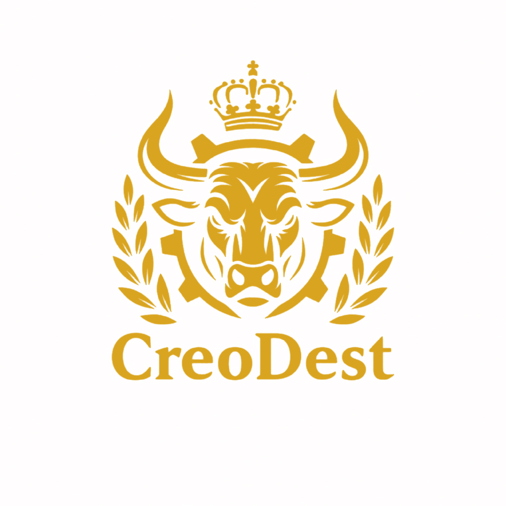

# CreoDest ウェブサイト 使用・更新ガイド

## ファイル構成

- `index.html` - トップページ
- `company.html` - 会社概要ページ
- `services.html` - サービス紹介ページ
- `contact.html` - お問い合わせページ
- `css/style.css` - スタイルシート
- `js/main.js` - JavaScript機能
- `images/` - 画像ファイル用ディレクトリ

## 主な特徴

- スタイリッシュでモダンなデザイン
- オレンジ系を基調としたカラースキーム
- 完全レスポンシブ対応（スマートフォン・タブレット・PC）
- 後からのロゴ追加に対応
- 会社情報（設立年月日・資本金など）の後入れに対応

## 更新方法

### ロゴの追加方法

1. ロゴ画像を `images` ディレクトリに配置します
2. 各ページの以下の部分を修正します:
```html
<div class="logo-placeholder">CreoDest</div>
```
を以下のように変更:
```html

```

### 会社情報の更新方法

1. `company.html` の以下の部分を修正します:
```html
<p><span class="label">設立年月日:</span> <span id="establishment-date">（後日更新）</span></p>
<p><span class="label">資本金:</span> <span id="capital">（後日更新）</span></p>
```
実際の情報に置き換えてください。

### その他の更新

- テキスト内容の変更: 各HTMLファイルを開き、該当箇所を編集
- スタイルの変更: `css/style.css` を編集
- 機能の変更: `js/main.js` を編集

## 注意事項

- 画像を追加する場合は `images` ディレクトリに配置してください
- ファイル名は日本語を避け、英数字を使用することを推奨します
- HTMLファイルの構造を大きく変更する場合は、レスポンシブデザインが崩れないよう注意してください

## サポート

ウェブサイトの更新や管理についてご質問がある場合は、お気軽にお問い合わせください。
